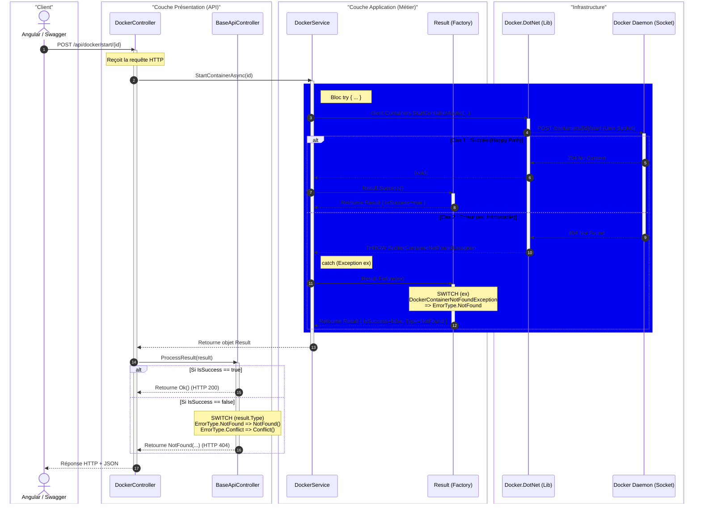
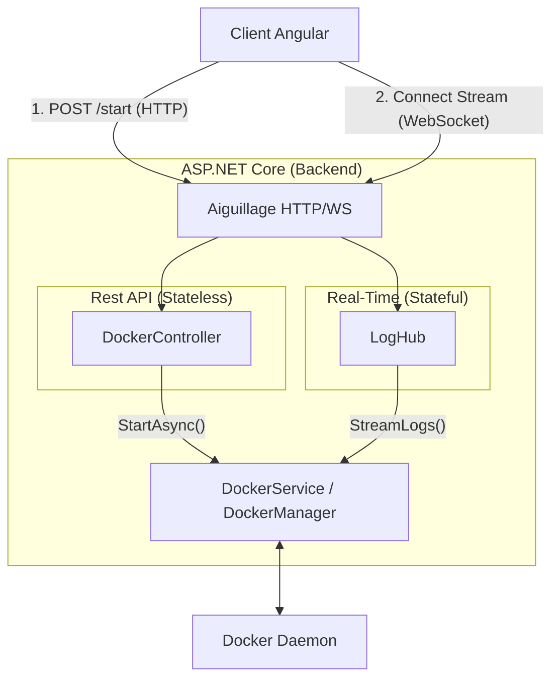

# LabMonitor application

## LabApi :

### Sequence diagram for starting a container :
This diagram illustrates the flow of a request to start a Docker container through the LabApi, showcasing the exception handling.



### Global application architecture

Show the overall architecture of the LabMonitor application, highlighting the interactions between the Angular client, ASP.NET Core backend, and Docker daemon.


### Log streaming architecture
This diagram illustrates the architecture for streaming logs from Docker containers to the Angular client using SignalR,

This is the code that allows to handle the concurrency and buffering of logs in memory, ensuring that the logs are sent to the client in a thread-safe manner.

```csharp

```

```mermaid
[ Thread Docker (Task.Run) ] 
       |
       | (Push binaire démultiplexé)
       v
[ PIPE (Buffer FIFO en RAM) ] <--- Gestion automatique de la concurrence (Locks)
       |
       | (Pull via StreamReader)
       v
[ Thread SignalR (IAsyncEnumerable) ]
       |
       | (Yield Return)
       v
[ Client Web (WebSocket) ]
```

### Test the log streaming :

To test the log streaming, you can use the Angular client to connect to the SignalR hub and display the logs in real-time. You can also use tools like Postman or curl to send requests to the REST API to start containers and trigger log streaming.

First :
```json
{"protocol":"json","version":1}
```

Then :
```json
{"type":4,"invocationId":"1","target":"GetLogStream","arguments":["7026077ea5f4"]}
```

**You must keep the special character ""** at the end of each message, as it is used by SignalR to delimit messages in the WebSocket stream.