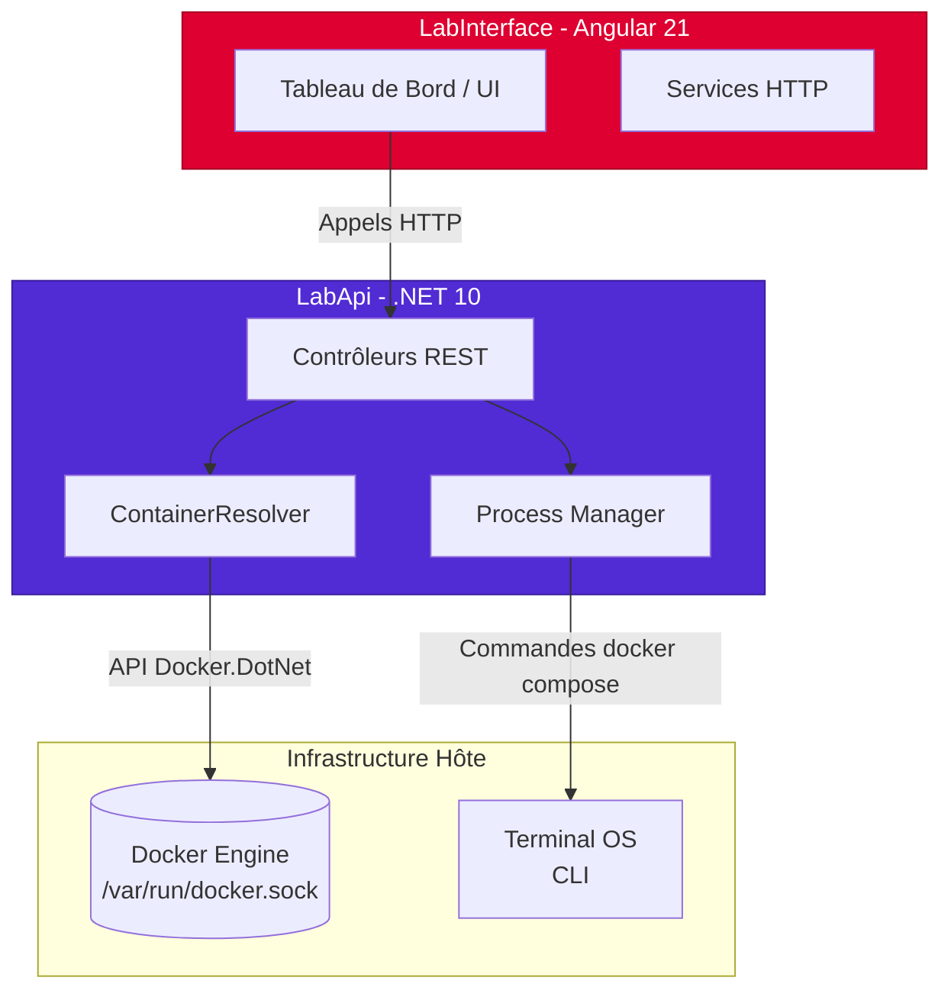
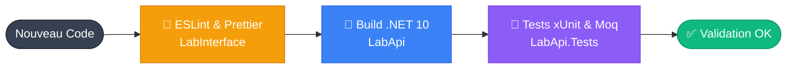

# LabMonitor

> **État du projet :** Ce projet est actuellement en cours de développement. Il s'agit d'un **prototype** (Proof of Concept) visant à créer une architecture robuste pour l'administration de conteneurs. Les fonctionnalités sont sujettes à évolution.

**LabMonitor** est un tableau de bord web sur-mesure (façon "mini-Portainer") conçu pour surveiller, piloter et administrer des conteneurs Docker et des stacks Docker Compose. Il offre une interface graphique moderne et fluide pour remplacer la complexité des lignes de commande CLI, tout en garantissant une exécution backend fiable et "stateless".

---

## Fonctionnalités Principales

*   **Vue d'ensemble par Projet :** Regroupement intelligent des conteneurs par stack (ex: `sae4`).
*   **Télémétrie en temps réel :** Affichage de la consommation CPU, de la RAM, et du nombre de conteneurs actifs/inactifs.
*   **Statuts de santé :** Indicateurs visuels (Sain, Attention, Erreur) basés sur l'état des sous-conteneurs (running, restarting, exited, dead).
*   **Filtrage Avancé :** Moteur de recherche puissant permettant de filtrer les conteneurs par `id`, `name` ou `image` via des opérateurs stricts (`eq`, `contains`, `startswith`, `endswith`).
*   **Gestion des Stacks :** Arrêt et démarrage dynamique des environnements `docker compose` directement depuis l'interface.

---

## Stack Technique

Le projet est divisé en deux applications distinctes, favorisant le découplage et la testabilité.

### Backend (`LabApi`)
*   **Framework :** .NET 10.0 (C#)
*   **Moteur Docker :** `Docker.DotNet` (via le socket `/var/run/docker.sock`)
*   **Exécution Système :** API `Process.Start` native pour l'exécution des commandes `docker compose` (remplace FluentDocker pour une meilleure stabilité stateless).
*   **Tests :** `xUnit` et `Moq` (Architecture orientée Interfaces et Injection de Dépendances).

### Frontend (`LabInterface`)
*   **Framework :** Angular 21 (avec Server-Side Rendering - SSR)
*   **Styling :** Tailwind CSS v4 (Thème sombre orienté Dashboard technique)
*   **Standards :** Utilisation du Control Flow moderne (`@if`, `@for`), de l'injection moderne (`inject()`), et respect strict des règles **ESLint** & **Prettier**.

---

## Architecture Système

Le diagramme ci-dessous illustre comment l'interface communique avec l'API, qui elle-même interagit avec le système Linux hôte et le démon Docker.

## Intégration Continue (CI) & Tests

La qualité du code est assurée par un pipeline de vérification en deux étapes : la validation syntaxique (Linter) côté Frontend, suivie par l'exécution des tests unitaires mockés côté Backend.

## Focus sur l'ingénierie des tests
Les tests de l'API sont isolés du moteur Docker physique grâce à Moq. Le système injecte des faux clients Docker (IDockerClient, IContainerOperations) pour garantir une exécution des tests en quelques millisecondes, quel que soit l'environnement hôte, et pour valider la logique de filtrage LINQ indépendamment de l'infrastructure.